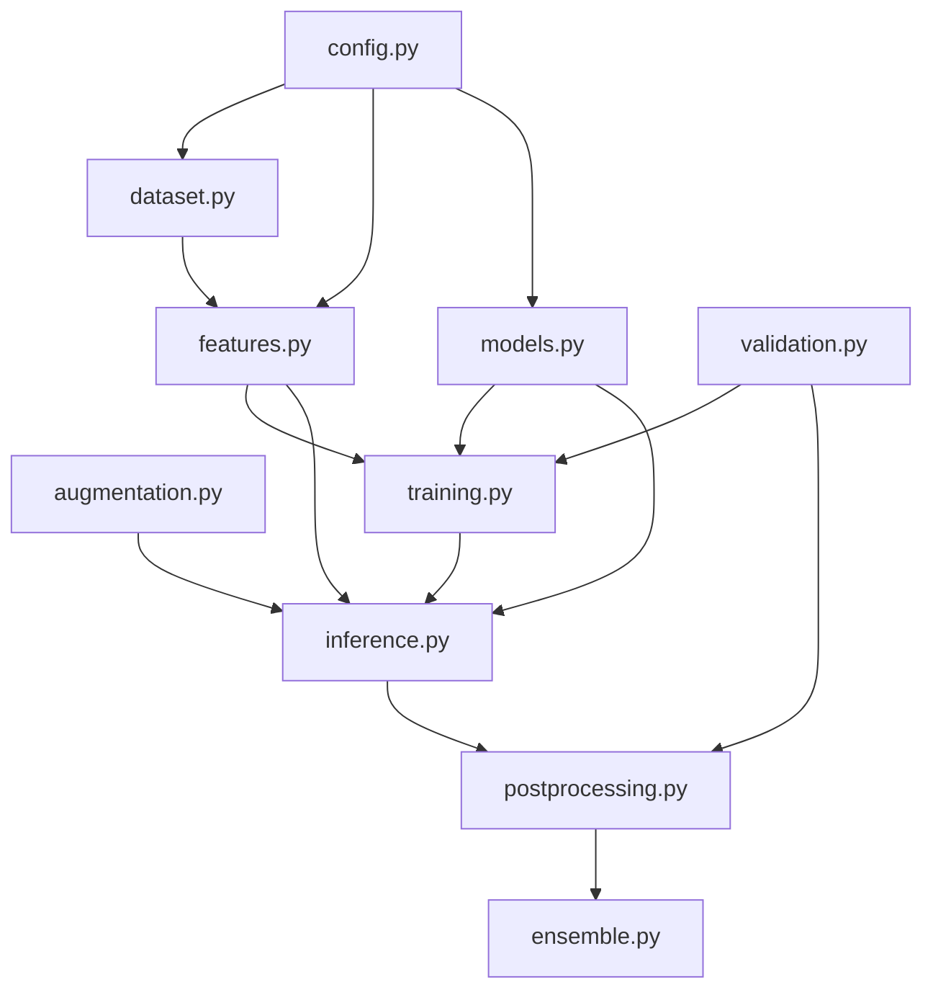

# BirdCLEF 2026 — Modular Refactoring Report

This report outlines the refactored layout of the BirdCLEF 2026 "Phoenix" bioacoustics research codebase, documenting the execution flows, dependency structures, and design choices.

---

## 1. Directory Structure Layout

The code has been reorganized from a monolithic Jupyter Notebook into a highly modular, decoupled structure under `refactored_codebase`:

```
refactored_codebase/
├── docs/
│   └── Architecture_Doc.md      # Mathematical & ecological documentation
├── src/
│   ├── __init__.py
│   ├── config.py                 # Hyperparameter & execution parameters
│   ├── dataset.py                # Audio loading, label mapping, & parsing
│   ├── augmentation.py           # Circular sequence rolling & flip TTA
│   ├── features.py               # Perch backbone & caching subsystems
│   ├── models.py                 # PyTorch S4-SSM, ResidualSSM, Vectorized MLP Probes
│   ├── training.py               # ProtoSSM, ResidualSSM, & MLP training runs
│   ├── validation.py             # Macro-AUC metrics & GKF cross validation splits
│   ├── inference.py              # Coordinating TTA runs & test-time predictions
│   ├── ensemble.py               # Blending algorithms (Direct & Division Attention)
│   └── postprocessing.py         # Calibration, priors, thresholds, & taxonomy smoothing
├── Refactoring_Report.md        # Codebase architecture & dependency flows (this file)
└── birdclef_refactored.ipynb    # Restructured entry point notebook
```

---

## 2. Dependency Flow Diagram

The modules are strictly structured to prevent circular dependencies. Downstream layers depend exclusively on upstream utility classes:



---

## 3. Execution Pipeline Flow

The execution workflow from audio files input to final submission format is detailed below:

```
[Audio Soundscapes] 
        │
        ▼ (dataset.read_60s)
[Raw Waveforms Batch]
        │
        ▼ (features.extract_features using ONNX/TF Perch)
[Perch Embeddings (1536D) & Logits (11K)]
        │
        ├──► Genus Proxies Mapping (features.TaxonomyMapper)
        │
        ▼ (training.train_light_proto_ssm / training.train_residual_ssm)
[Model Training Outputs] ── (Inference-time or OOF Validation)
        │
        ▼ (inference.run_sequence_inference)
[First Pass SSM + ResidualSSM Blended Logits]
        │
        ▼ (postprocessing.apply_postprocessing)
[Temperature-Scaled + Conf-Scaled + Temporal-Smoothed Probs]
        │
        ▼ (postprocessing.apply_calibration)
[Isotonic-Calibrated Probabilities]
        │
        ▼ (postprocessing.apply_threshold_sharpening)
[Sharpened Probabilities]
        │
        ▼ (postprocessing.f_TAX_SMOOTHING_POSTPROC)
[Uncertainty-Gated Taxonomy & Temporal Smoothing]
        │
        ▼ (ensemble.division_attention_blend or direct_blend)
[Final Ensemble CSV Output]
```

---

## 4. Key Improvements and Design Patterns

### 1. Separation of Concerns
Each logical notebook block has been relocated to its respective module. E.g., PyTorch models (`models.py`) are fully decoupled from training runs (`training.py`), and post-processing calibration functions are isolated in `postprocessing.py`.

### 2. Extensible Configuration
The `Config` class in `config.py` acts as the single source of truth for hyperparameters. Training and submission configurations are dynamically handled based on execution mode flags.

### 3. Explicit Validation Parity
By packaging the exact scaling, calibration, and smoothing transforms into `postprocessing.apply_postprocessing` and `postprocessing.run_corrected_calibration_pipeline`, we guarantee parity between OOF validation optimization and submission-time test inference, preventing code drift.

### 4. Vectorized MLP Probes Grouping
To avoid shape mismatch issues during parallel processing of MLPs with different layer sizes (e.g. rare species using `(128, 64)` and frequent using `(256, 128)`), the probes are partitioned by hidden size before stack feeding through `VectorizedMLPProbes` in `features.py` and `training.py`.
