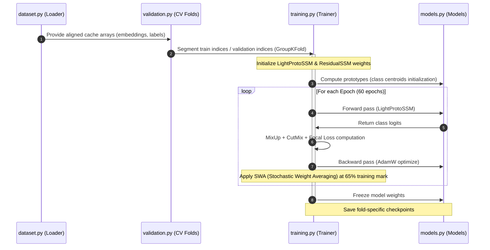

# BirdCLEF 2026 — Phoenix Pipeline Architecture Flows

This document details the step-by-step execution pathways for data flow, model training, test-time inference, ensembling, and post-processing in the Phoenix architecture.

---

## 1. Data Flow Pipeline

The pathway of an audio clip through pre-processing and feature extraction:

```text
Audio File (.ogg)
    ↓ (dataset.sf.read @ 32kHz, downmix to mono)
Waveform array: X_raw ∈ R^(1,920,000) for a 60s file
    ↓ (dataset.prepare_labeled_matrix / windowing)
12 consecutive windows: X_wind ∈ R^(12, 160,000)
    ↓
    ├─────────────────────────────┐
    ▼                             ▼
Google Perch v2 ONNX          Distilled Teacher ONNX
(1536D penult feature)        (768D penult feature)
    │                             │
    ▼                             ▼
E_perch ∈ R^(12, 1536)        E_teach ∈ R^(12, 768)
    │                             │
    └──────────────┬──────────────┘
                   ▼ (Concatenation)
           E_joint ∈ R^(12, 2304) (MultiBackboneExtractor feature)
                   ↓
           Linear projection → d_model (384)
```

---

## 2. Model Training Pipeline

Cross-validation training sequence for fold-isolated models:



---

## 3. Test-Time Inference Pipeline (with TTA)

Execution flow during submission generation on unobserved test soundscapes:

```text
Test Waveforms
    ↓
MultiBackboneExtractor (Perch + Teacher)
    ↓
Embeddings (Emb ∈ R^(B_files, 12, D_feat)) & Raw Logits (Log ∈ R^(B_files, 12, C))
    ↓
    ├─────────────────── Test-Time Augmentation (TTA) ───────────────────┐
    ▼                                                                    ▼
For shifts [0, 1, -1, 2, -2]:                                          Compute TTA Variance
Roll sequence: Emb_shifted = roll(Emb, shift)                           Var = variance(preds)
    │                                                                    │
    ▼                                                                    │
LightProtoSSM forward pass                                               │
    │                                                                    │
    ▼                                                                    │
Unroll predictions: Pred_unrolled = roll(Pred_shifted, -shift)           │
    │                                                                    │
    ▼ (Averaging)                                                        │
Mean ProtoSSM predictions (Pred_proto)                                   │
    │                                                                    │
    ▼                                                                    │
ResidualSSM forward pass (input: [Emb, Pred_proto])                      │
    │                                                                    │
    ▼                                                                    │
Apply residual correction:                                                │
Pred_corr = Pred_proto + w_correction * correction                       │
    │                                                                    │
    ▼                                                                    │
EmbeddingRetrievalHead (k-NN prediction for unmapped/rare species)        │
    │                                                                    │
    ├─────────────────────────────────┘                                  │
    ▼                                                                    ▼
Final raw predictions (Scores & Retrieval Probs) ──────────────────► Post-Processing Gating
```

---

## 4. Post-Processing & Smoothing Pipeline

Adjustments made to final predictions to optimize Macro-AUC and F1 scores:

```text
Final raw scores
    ↓ (apply_prior)
Site/Hour Prior Logit Addition (cyclic gaussian smoothed)
    ↓ (sigmoid)
Probability space (probs ∈ [0, 1])
    ↓ (file_confidence_scale)
File Confidence Scaling (scaling via average of top-K window predictions)
    ↓ (rank_aware_scaling)
Rank-Aware Scaling (scaling by maximum file-level probability)
    ↓ (apply_retrieval_blend)
Retrieval Head Blend (covers unmapped & rare species)
    ↓ (apply_calibration)
Isotonic Calibration (per-class regressors & shared taxon fallbacks)
    ↓ (apply_threshold_sharpening)
Decision Threshold Sharpening
    ↓ (f_TAX_SMOOTHING_POSTPROC)
Uncertainty-Gated Taxonomy Smoothing (entropy & TTA variance gated)
    ↓ (conservative_temporal_consistency)
Temporal Consistency Adjustment
    ↓
Final Outputs (submission.csv)
```
