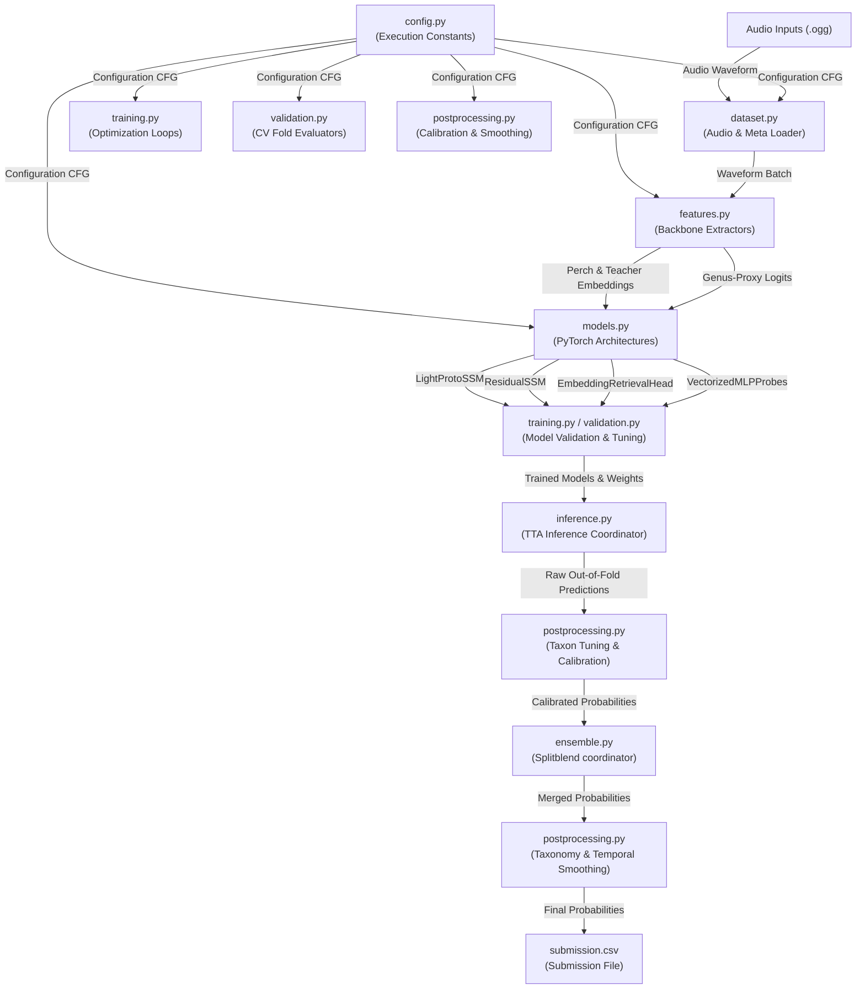

# BirdCLEF 2026 — Phoenix Pipeline Dependency Graph

This document details the compile-time and execution-time dependencies across modules in the Phoenix architecture.

---

## 1. High-Level Flow Chart

The diagram below maps the execution sequence and dependencies from raw input audio through feature extraction, models, calibration, ensembling, and post-processing.

---

## 2. Module Dependency Matrix

| Target Module | Depends On | Purpose of Dependency |
|---|---|---|
| [config.py](file:///c:/Users/koust/Documents/Kaggle/Bird_AudioPred/refactored_codebase/src/config.py) | *None* | Serves as the central repository for execution constants, settings, and model configurations. |
| [dataset.py](file:///c:/Users/koust/Documents/Kaggle/Bird_AudioPred/refactored_codebase/src/dataset.py) | [config.py](file:///c:/Users/koust/Documents/Kaggle/Bird_AudioPred/refactored_codebase/src/config.py) | Audio sampling rates, windows constants, class sizes, and batch settings. |
| [augmentation.py](file:///c:/Users/koust/Documents/Kaggle/Bird_AudioPred/refactored_codebase/src/augmentation.py) | *None* | Implements sequence rolls and bidirectional horizontal flip augmentations on raw arrays. |
| [features.py](file:///c:/Users/koust/Documents/Kaggle/Bird_AudioPred/refactored_codebase/src/features.py) | [config.py](file:///c:/Users/koust/Documents/Kaggle/Bird_AudioPred/refactored_codebase/src/config.py), [dataset.py](file:///c:/Users/koust/Documents/Kaggle/Bird_AudioPred/refactored_codebase/src/dataset.py) | Uses dataset.py utilities to batch-load raw 60-second audio files for ONNX extraction. |
| [models.py](file:///c:/Users/koust/Documents/Kaggle/Bird_AudioPred/refactored_codebase/src/models.py) | [config.py](file:///c:/Users/koust/Documents/Kaggle/Bird_AudioPred/refactored_codebase/src/config.py) | Configures sequence dimensions and class prototype counts dynamically. |
| [training.py](file:///c:/Users/koust/Documents/Kaggle/Bird_AudioPred/refactored_codebase/src/training.py) | [config.py](file:///c:/Users/koust/Documents/Kaggle/Bird_AudioPred/refactored_codebase/src/config.py), [models.py](file:///c:/Users/koust/Documents/Kaggle/Bird_AudioPred/refactored_codebase/src/models.py) | Accesses model parameters, optimizer architectures, learning rates, loss functions, and weight averaging parameters. |
| [validation.py](file:///c:/Users/koust/Documents/Kaggle/Bird_AudioPred/refactored_codebase/src/validation.py) | [config.py](file:///c:/Users/koust/Documents/Kaggle/Bird_AudioPred/refactored_codebase/src/config.py) | Cross-validation fold splitting strategies (GroupKFold by recording site). |
| [inference.py](file:///c:/Users/koust/Documents/Kaggle/Bird_AudioPred/refactored_codebase/src/inference.py) | [config.py](file:///c:/Users/koust/Documents/Kaggle/Bird_AudioPred/refactored_codebase/src/config.py), [models.py](file:///c:/Users/koust/Documents/Kaggle/Bird_AudioPred/refactored_codebase/src/models.py), [augmentation.py](file:///c:/Users/koust/Documents/Kaggle/Bird_AudioPred/refactored_codebase/src/augmentation.py) | Applies test-time sequence shift augmentations, executes forward inference sessions, and runs error correction. |
| [ensemble.py](file:///c:/Users/koust/Documents/Kaggle/Bird_AudioPred/refactored_codebase/src/ensemble.py) | [config.py](file:///c:/Users/koust/Documents/Kaggle/Bird_AudioPred/refactored_codebase/src/config.py) | Splits ensembling weights across taxons / scientific class indices. |
| [postprocessing.py](file:///c:/Users/koust/Documents/Kaggle/Bird_AudioPred/refactored_codebase/src/postprocessing.py) | [config.py](file:///c:/Users/koust/Documents/Kaggle/Bird_AudioPred/refactored_codebase/src/config.py) | Scales and smooths raw output logits dynamically using site/hour prior lookups and isotonic regression. |
| [main.py](file:///c:/Users/koust/Documents/Kaggle/Bird_AudioPred/refactored_codebase/main.py) | *All source modules* | Coordinates the entire execution, training, OOF tuning, ensembling, postprocessing, and evaluation pipeline. |
