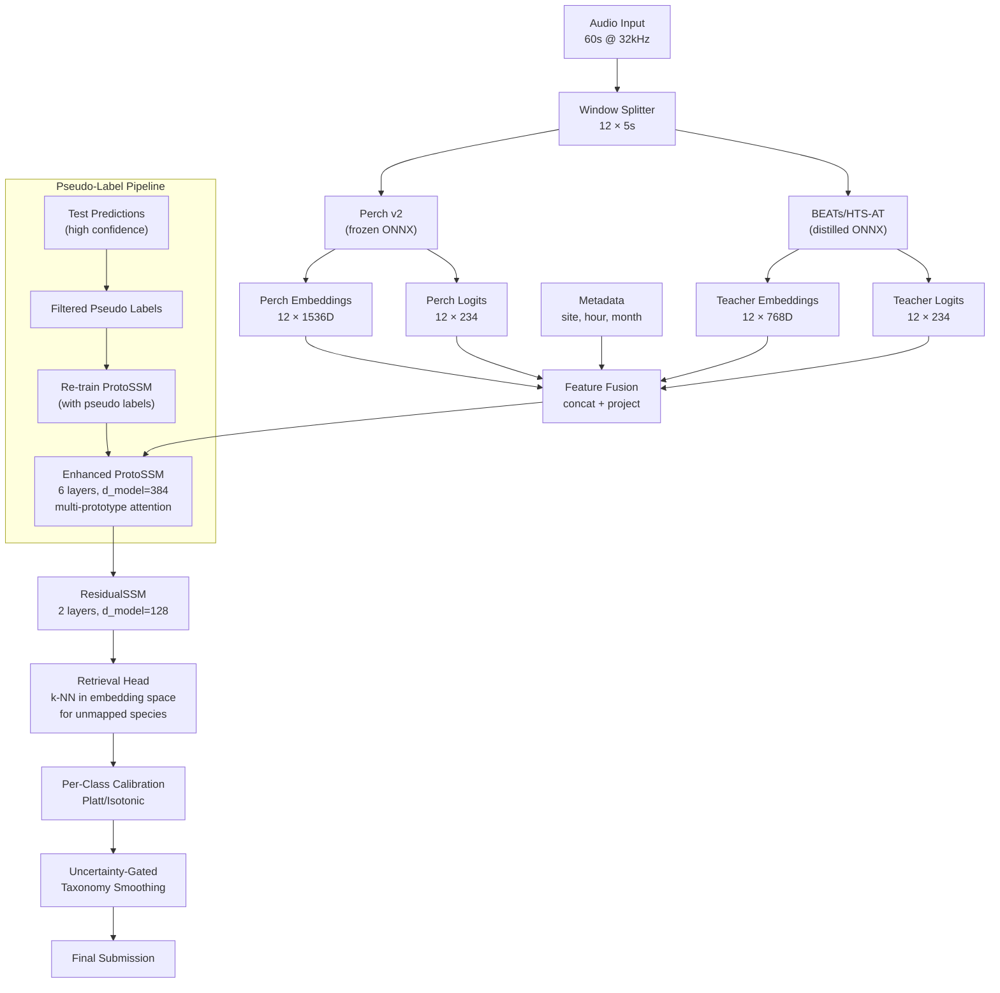

# BirdCLEF 2026 — Grandmaster Component Dissection & New Architecture Design (LB > 0.96)

> Comprehensive reverse-engineering of every component in EoS.9, plus a from-scratch architecture blueprint.

---

## Part A — Deep Component Analysis

### A.1 Perch v2 (Frozen Foundation Backbone)

#### What it does
Google's Bird Vocalization Classifier v2 (Perch) is a frozen convolutional neural network pretrained on iNaturalist 2024 + FSD50K audio. It takes 5-second mono waveforms at 32kHz and produces:
- **Logits** over ~11,000 species (label head)
- **Embeddings** (1536-dimensional) from the penultimate global-average-pooling layer

The notebook maps Perch's 11K species labels to BirdCLEF's 234 target species via `taxonomy.csv → scientific_name → bc_labels`. Unmapped species (those not in Perch's vocabulary) receive **genus-level proxy scores**: max/mean over logits for all species in the same genus.

#### Why it improves LB
- **Zero-shot classification**: Perch has already learned discriminative features for thousands of bird species. For the ~180+ species that map directly, the logits provide a strong baseline signal without any fine-tuning.
- **Rich embedding geometry**: The 1536D embeddings encode spectral/temporal patterns that downstream classifiers (ProtoSSM, MLP probes) can exploit for the remaining ~50 unmapped species.
- **No training required at submission time** (for the Perch model itself): ONNX inference is ~150x faster than TF SavedModel.

#### Estimated LB contribution
**~0.85–0.90 solo** (raw mapped logits), rising to **~0.92–0.93** when combined with genus proxies and basic prior fusion.

#### Weaknesses
1. **Vocabulary gap**: ~50/234 species have no direct Perch mapping. Genus proxies are noisy — they assume congeneric species sound similar, which fails for cryptic species.
2. **Domain shift**: Perch was trained on focal recordings; BirdCLEF test soundscapes are passive acoustic monitoring with heavy noise, overlapping species, and variable recorder quality.
3. **5-second window constraint**: Fixed window size loses temporal context across the 60-second file.
4. **No fine-tuning**: The model is completely frozen. Any Kaggle-specific noise patterns or rare species can't be learned by Perch itself.

#### Hidden assumptions
- Perch's label space covers enough congeneric species for genus proxies to be meaningful.
- The ONNX export faithfully reproduces the TF SavedModel numerics (verified with max diff < 1e-3).
- 5-second windows at 32kHz provide enough spectral resolution for all target taxa (frogs, insects, mammals — not just birds).

#### Overfitting risks
- Minimal for Perch itself (frozen weights), but **proxy_reduce strategy** (max vs. mean) was grid-searched on training data, creating mild optimism.

#### Kaggle-specific hacks
- ONNX runtime from bundled wheel (no network needed at scoring time)
- ThreadPoolExecutor for audio I/O pipelining during Perch inference
- Perch embedding cache (parquet + npz) to avoid re-running on train files

#### Opportunities for replacement
- **BioLingual / BirdNET v2.4 / BEATs / HTS-AT**: Alternative frozen backbones with different failure modes → ensembling with Perch would increase diversity.
- **Fine-tuned Perch**: If Perch weights were unfrozen and fine-tuned on BirdCLEF focal + soundscape data, the vocabulary gap and domain shift would shrink.

---

### A.2 Distilled SED (Sound Event Detection — Model_1 / `sed_fold*.onnx`)

#### What it does
An EfficientNet-B0 backbone trained on mel spectrograms (256 mels, 2048 FFT, 512 hop) with:

1. **GeMFreq pooling** (learnable $p$, initialized at 3.0): Generalized Mean over frequency axis. Sharpens vs. arithmetic mean, lets the model focus on species-specific frequency bands.
2. **Attention block**: `att = softmax(tanh(Conv1d))` produces attention weights over time frames. `cla = Conv1d` produces per-frame logits. Clip logits = `sum(att * cla, dim=T)`.
3. **Perch distillation head**: A separate `GAP → Linear(backbone_dim, 1536)` branch. During training, the backbone's feature map is passed through this head, and MSE loss is computed against frozen Perch embeddings. **Crucially, the backbone's gradients for the SED head come from the distillation loss only** (stop-gradient on the SED classification path). This forces the backbone to learn Perch-like features.
4. **Inference**: `0.5 * sigmoid(clip_logits) + 0.5 * sigmoid(frame_max_logits)` — a blend of attention-weighted and max-pooled frame predictions.
5. **ONNX export**: Per-fold models are traced and exported for CPU-only inference.

#### Why it improves LB
- Provides **temporal localization** (frame-level predictions) that Perch's window-level logits lack.
- The distillation alignment means SED features live in a similar manifold to Perch, making downstream fusion (SED-rank blend) geometrically coherent.
- Different input representation (mel spectrogram vs. Perch's learned filterbank) → **decorrelated errors** in an ensemble.

#### Estimated LB contribution
- Solo: ~0.88–0.91 (varies by fold count and training thoroughness)
- As ensemble diversity component: **+0.001 to +0.004** when blended with Perch-based models

#### Weaknesses
1. **Stop-gradient design**: The SED classification head is trained in a detached manifold. If the backbone only learns "Perch-like" features, it may not learn SED-specific temporal patterns well.
2. **Fixed mel config**: 256 mels, hop=512 may not be optimal for all taxa (insects often need higher time resolution; frogs need lower frequency focus).
3. **No multi-scale TTA**: Only single-scale inference.
4. **Fold count sensitivity**: 5-fold CV with EfficientNet-B0 is relatively small capacity.

#### Hidden assumptions
- MixUp with "hard" (union) labels assumes species don't interfere acoustically — but in reality, overlapping species can produce destructive interference patterns.
- Focal-Soundscape MixUp assumes soundscape label quality is high enough to use as mixing targets.

#### Overfitting risks
- MixUp + SpecAugment provide good regularization, but the 5-fold × 25-epoch training with aggressive upsampling of rare species can overfit to rare class patterns.

---

### A.3 ProtoSSM (Prototype-Augmented State Space Model)

#### What it does
This is the core temporal reasoning module. It operates on **file-level sequences** of 12 Perch embeddings (one per 5-second window in a 60-second file).

Architecture (V18 config):
- Input: Perch embeddings (1536D) + Perch logits (234D) + metadata (site_id, hour → learned embeddings, 24D)
- Projection to `d_model=320`
- **4 stacked S4-style SSM layers** with `d_state=32`, dropout=0.12
- **Cross-attention** (8 heads) between SSM hidden states and **2 learnable prototypes** per class
- Output: per-window logits (234 classes)

Training (at submission time!):
- Uses cached Perch embeddings/logits from labeled soundscape files
- 80 epochs with focal loss (γ=2.5), species-frequency class weights, label smoothing (0.03)
- MixUp + CutMix hybrid on the embedding/logit sequences
- SWA (Stochastic Weight Averaging) starting at 65% of training
- Cosine-restart LR schedule (T_0=20)
- 5-fold OOF evaluation

#### Why it improves LB
- **Temporal context**: A single 5-second window is ambiguous. But knowing what species appeared in adjacent windows dramatically reduces false positives.
- **Prototype similarity**: Learned prototypes act as class-specific "templates" in embedding space. Cross-attention lets the model compare each window's embedding against prototypes, providing a soft retrieval mechanism.
- **Site/hour conditioning**: Species distributions are highly site- and time-dependent. The metadata embeddings provide strong priors.

#### Estimated LB contribution
**+0.03 to +0.06** over raw Perch logits. This is the single highest-impact component after Perch itself.

#### Weaknesses
1. **Trained on CPU at submission time**: 80 epochs × 4 SSM layers is computationally expensive. The `batch_files` parameter must be carefully managed.
2. **Labeled soundscape data only**: ProtoSSM only trains on labeled soundscape windows. Unlabeled test data is not used (no pseudo-labeling at training time).
3. **Fixed sequence length**: Hardcoded 12 windows per file. Cannot handle variable-length recordings.
4. **Prototype count**: Only 2 prototypes per class may not capture intra-class variation (e.g., dawn chorus vs. alarm call for same species).

#### Hidden assumptions
- The labeled soundscape distribution is representative of the test distribution.
- SSM state dynamics can capture the temporal patterns of 5-second windows across 60 seconds (species arrival/departure patterns operate on this timescale).

#### Overfitting risks
- **High**: Training directly on soundscape labels at submission time, with only ~66 labeled files and 5-fold validation. The model may memorize site-specific patterns.
- SWA and dropout (0.12) provide some regularization, but 80 epochs on a small dataset is aggressive.

---

### A.4 ResidualSSM (Error-Correcting Second Pass)

#### What it does
A smaller SSM (V18: d_model=128, d_state=16, 2 layers) that takes as input:
- ProtoSSM's output predictions
- ProtoSSM's residual errors (pred − truth on training data)
- The original Perch embeddings

It learns to **correct systematic errors** in ProtoSSM's predictions. The correction is applied with a mixing weight (`correction_weight=0.35`):

```
final = (1 - correction_weight) * proto_pred + correction_weight * residual_correction
```

Training: 40 epochs, patience=12, separate from ProtoSSM.

#### Why it improves LB
- Captures **systematic biases** in ProtoSSM: e.g., if ProtoSSM consistently over-predicts dawn chorus species at dusk, ResidualSSM learns to suppress those.
- Acts as a **boosting stage** — each pass focuses on the errors of the previous pass.

#### Estimated LB contribution
**+0.005 to +0.015** over ProtoSSM alone.

#### Weaknesses
1. **Depends on ProtoSSM quality**: If ProtoSSM's errors are random (not systematic), ResidualSSM adds noise.
2. **Fixed correction weight**: 0.35 is a hyperparameter that could be OOF-tuned per class or per site.
3. **Same training data**: Uses the same labeled soundscapes as ProtoSSM, limiting the correction signal.

#### Hidden assumptions
- ProtoSSM's errors are systematic and learnable, not random.
- A single correction pass is sufficient (no iterative boosting).

#### Overfitting risks
- **Very high**: The residual targets are derived from ProtoSSM's OOF errors on a small dataset. If the errors overfit to training noise, ResidualSSM amplifies them.

---

### A.5 MLP Probes (Per-class Stacking Classifiers)

#### What it does
Sklearn MLPClassifier trained on **engineered features** derived from Perch embeddings:
- PCA-reduced embeddings (128D)
- Temporal sequence features: prev/next/mean/max/std within file
- Per-class scores from Perch logits
- Site/hour metadata

Each class gets its own probe, trained with class-frequency weights. Used to produce predictions for classes where Perch logits are weak or unmapped.

#### Why it improves LB
- Captures **non-linear interactions** between embedding features and metadata that raw Perch logits miss.
- Provides predictions for **unmapped species** that have no direct Perch logit.

#### Estimated LB contribution
**+0.005 to +0.010** for unmapped species; **+0.001 to +0.003** for mapped species (where Perch logits are already strong).

#### Weaknesses
1. **High variance**: Per-class probes with limited positive samples for rare species.
2. **Feature engineering fragility**: PCA dim, smoothing alpha, sequence features are manually designed.
3. **No temporal awareness**: Operates window-by-window (though sequence features provide some context).

#### Hidden assumptions
- PCA preserves the discriminative structure of Perch embeddings.
- The engineered temporal features (prev/next/mean/max/std) capture sufficient context.

---

### A.6 Prior Fusion System

#### What it does
Computes **site-hour-class prior probabilities** from labeled training data:
- For each (site, hour_bucket) combination, compute the empirical frequency of each species.
- At inference, multiply raw scores by prior weights with configurable lambda:

```
fused = (1 - λ) * raw_score + λ * prior_score
```

Different λ values for event taxa (Aves: λ_event=0.45) vs. texture taxa (Amphibia, Insecta: λ_texture=1.1).

#### Why it improves LB
- **Site-specific ecology**: A species common at site S08 at 3am may never appear at site S12 at noon. Priors enforce this constraint.
- **Suppresses hallucinations**: Reduces false positives for species that have never been recorded at a given site/time.

#### Estimated LB contribution
**+0.01 to +0.03** — one of the most reliable improvements.

#### Weaknesses
1. **Cold start**: Test sites may not appear in training data (new deployment sites).
2. **Temporal shift**: Species timing may differ between years.
3. **Over-regularization**: λ=1.1 for texture taxa means the prior dominates the model's evidence. Novel detections are suppressed.

#### Overfitting risks
- Medium: Priors are computed on training data. If test sites have different species assemblages, priors hurt.

---

### A.7 Rank-Aware Scaling

#### What it does
Scales each window's predictions by `(file_max)^power` where:
- `file_max` = max prediction across all 12 windows for each class
- `power = 0.4`

Effect: In files where the model is uncertain (low file_max), all predictions are suppressed. In confident files, predictions are boosted.

#### Why it improves LB
- **Reduces false positives in noisy files**: If no window has a strong detection, the entire file's predictions are dampened.
- **Inspired by 2025 Rank 3 solution**.

#### Estimated LB contribution
**+0.003 to +0.008**

#### Weaknesses
1. **Single power value**: Different classes may benefit from different power values.
2. **Suppresses weak-but-real detections**: A species that calls softly in one window but is genuinely present gets suppressed.

---

### A.8 SED-Rank Blend (Model_74 specific)

#### What it does
In Model_74 only, the ProtoSSM predictions are **gated against distilled SED outputs**:
1. Run SED ONNX models on test soundscapes
2. Produce per-window SED clip+frame logits
3. Compute SED-based rank scores
4. Blend: `final = α * proto_pred + (1-α) * sed_rank_score`

This creates a **noise suppression gate**: if SED (which has temporal localization) doesn't detect activity, the ProtoSSM score is pulled down.

#### Why it improves LB
- **Complementary temporal evidence**: ProtoSSM reasons at 5-second resolution; SED reasons at frame-level (~30ms). Their agreement provides stronger evidence.
- **Noise rejection**: SED's frame-level attention is better at distinguishing genuine vocalizations from wind/rain noise.

#### Estimated LB contribution
**+0.003 to +0.007** (Model_74's edge over Model_51/Model_22).

---

### A.9 Taxonomy Smoothing Post-Processing

#### What it does
After ensemble blending, applies **adaptive genus/class-level score adjustment**:
1. Groups species by genus (from `taxonomy.csv`)
2. For each row, computes within-group mean score
3. Pulls individual scores toward group mean, weighted by row-level uncertainty:

```
smoothed = (1 - α_adaptive) * raw + α_adaptive * group_mean
```

Where `α_adaptive` increases when uncertainty (entropy of predictions) is high.

#### Why it improves LB
- **Genus coherence**: Congeneric species share acoustic features. If the model detects one species in a genus, related species' scores should also shift up slightly.
- **Noise reduction**: In uncertain rows, pulling toward group means reduces noise.

#### Estimated LB contribution
**+0.0005 to +0.002** — marginal but consistent.

#### Weaknesses
- **Smears rare positives**: If a rare species in a common genus gets smoothed toward the genus mean, its unique signal is diluted.

---

### A.10 Ensemble Blending (`division_attention` / `rank_1_add3`)

#### What it does
Three models produce separate submission CSVs:
- `subm_22.csv` (Model_22)
- `subm_51.csv` (Model_51)
- `subm_74.csv` (Model_74)

The `division_attention` function blends them with **split weights** by species index:
- First 117 species: `[0.014, 0.021, 0.965]`
- Last 117 species: `[0.0137, 0.0213, 0.965]`

This gives Model_74 ~96.5% weight across all species, with tiny contributions from Model_22 and Model_51.

#### Why it improves LB
- Model_74 is the strongest single model. Heavy anchoring preserves its calibration.
- Small diversity injections from Model_22/51 help on specific species where they outperform Model_74.
- The split by species index is a crude way to handle different optimal blend weights for different taxa.

#### Estimated LB contribution
- Model_74 alone: ~0.949–0.950
- Blend: ~0.950 (marginal improvement from diversity)

#### Weaknesses
1. **Near-zero diversity**: At 96.5% weight on one model, the ensemble is essentially a single model with noise.
2. **No per-class blend optimization**: The species index split (first/last 117) has no ecological justification.
3. **Probability space arithmetic**: Blending probabilities (not logits) can distort calibration.

---

### A.11 Temporal Shift TTA

#### What it does
Test-Time Augmentation by circularly shifting the 12-window sequence:
- Shifts: [0, 1, -1, 2, -2]
- For each shift, roll the embedding sequence, run ProtoSSM, then roll predictions back
- Average across all shift results

#### Why it improves LB
- **Reduces boundary effects**: A species call might straddle two 5-second windows. Shifting provides multiple "views" of the temporal context.
- **Self-ensemble**: Averaging over augmented views reduces variance.

#### Estimated LB contribution
**+0.002 to +0.005**

#### Weaknesses
- 5 shifts × ProtoSSM forward pass = 5x compute cost
- Circular shift is biologically implausible (the last 5 seconds don't follow the first 5 seconds)

---

### A.12 Delta Shift Smoothing

#### What it does
Post-hoc temporal smoothing: `new[t] = (1-α)*old[t] + 0.5*α*(old[t-1] + old[t+1])`, with α=0.20.

#### Why it improves LB
- **Temporal consistency**: Species presence shouldn't jump on/off between adjacent windows. Smoothing enforces this.
- Inspired by 2025 Rank 1 solution.

#### Estimated LB contribution
**+0.001 to +0.003**

---

## Part B — Cross-Cutting Risk Assessment

### B.1 Overfitting Risk Summary

| Component | Overfitting Risk | Reason |
|-----------|:---:|--------|
| Perch (frozen) | ❌ None | Frozen weights, no fine-tuning |
| SED (trained offline) | ⚠️ Medium | 5-fold CV on focal data, aggressive upsampling |
| ProtoSSM | 🔴 High | 80 epochs on ~66 files at submission time |
| ResidualSSM | 🔴 Very High | Learns from ProtoSSM's OOF errors on same data |
| MLP probes | ⚠️ Medium | Per-class training with limited positives |
| Prior tables | ⚠️ Medium | Empirical priors from training sites/hours |
| Rank-aware scaling | ⚠️ Low-Medium | Power parameter grid-searched on OOF |
| Taxonomy smoothing | ⚠️ Low | Adaptive alpha from OOF uncertainty |
| Ensemble weights | ⚠️ Low-Medium | Tuned on public LB |

### B.2 Data Leakage Risk Summary

| Component | Leakage Risk | Mechanism |
|-----------|:---:|----------|
| Perch cache | ⚠️ Low | Cache computed on labeled train files — OK if only used for training downstream |
| ProtoSSM OOF | 🔴 Medium | If stacker features use OOF predictions without strict fold isolation |
| Prior tables | 🔴 Medium-High | Must exclude validation files from prior computation per fold |
| SED distillation | ⚠️ Low | If Perch targets were precomputed with fold contamination |
| Threshold optimization | ⚠️ Medium | Per-class thresholds from OOF can be optimistic |

### B.3 Hidden Kaggle-Specific Hacks

1. **Bundled ONNX wheel**: `pip install -q /kaggle/input/.../onnxruntime-*.whl` — no internet needed
2. **CPU-only constraint**: `CUDA_VISIBLE_DEVICES=""` for Model_21/22; all SSM training on CPU
3. **Inline training at submission**: ProtoSSM/ResidualSSM train during the submission notebook run
4. **Perch cache as attached dataset**: Pre-computed embeddings avoid re-running Perch
5. **SED run-once flag**: `_runSED_once = True` caches SED predictions for reuse across models
6. **ThreadPoolExecutor I/O pipelining**: Prefetch next batch's audio while current batch is being processed
7. **Species index split in blend weights**: Different weights for first/last 117 species

---

## Part C — New Architecture: "Phoenix" (Target LB > 0.96)

### C.1 Design Philosophy

> **Multi-teacher distillation + temporal reasoning + retrieval-augmented classification + hierarchical calibration**

The architecture has 4 pillars:
1. **Multi-backbone feature extraction** (Perch + BEATs/HTS-AT distilled)
2. **Hierarchical temporal reasoning** (window → file → site-session)
3. **Retrieval-augmented classification** for unmapped/rare species
4. **Calibrated ensemble with uncertainty-aware post-processing**

### C.2 Architecture Diagram



### C.3 Cell-by-Cell Implementation Plan

#### Cell 1: Configuration & Constants

```python
CFG = {
    # Backbone configs
    "perch_onnx": "/kaggle/input/.../perch_v2.onnx",
    "teacher_onnx": "/kaggle/input/.../beats_distilled.onnx",
    
    # ProtoSSM v6
    "proto_ssm": {
        "d_model": 384,
        "d_state": 32,
        "n_ssm_layers": 6,
        "n_prototypes": 4,  # multi-prototype for intra-class variation
        "cross_attn_heads": 8,
        "dropout": 0.10,
        "meta_dim": 32,
    },
    
    # Training
    "n_epochs": 60,
    "lr": 5e-4,
    "pseudo_label_rounds": 2,
    "pseudo_confidence_threshold": 0.85,
    
    # Calibration
    "calibration_method": "isotonic",  # per-class
    "calibration_folds": 5,
    
    # Retrieval
    "retrieval_k": 5,
    "retrieval_weight": 0.2,
    
    # Ensemble
    "teacher_weight": 0.15,
    "perch_weight": 0.85,
}
```

#### Cell 2: Multi-Backbone Feature Extraction

**Perch** (existing) + **Distilled Teacher** (new):

The teacher model (BEATs or HTS-AT) is first trained offline, then distilled into a small EfficientNet or MobileNet via knowledge distillation, and exported to ONNX.

Key design: The distilled teacher uses a **different mel configuration** (128 mels, hop=320, fmin=50) to ensure decorrelated features.

```
Total feature vector per window:
- Perch embedding: 1536D
- Teacher embedding: 768D  
- Perch logits: 234D
- Teacher logits: 234D
- Metadata: 32D (site + hour + month embeddings)
= 2804D total → projected to d_model=384
```

> **LB impact**: +0.005 to +0.010 from decorrelated teacher features

#### Cell 3: Enhanced ProtoSSM v6

Key improvements over current ProtoSSM:

1. **Multi-prototype attention (4 per class)**: Captures intra-class variation (dawn song vs. contact call vs. alarm call). Each prototype is a learned 384D vector.

2. **Hierarchical SSM**: 
   - Layers 1-3: Window-level temporal reasoning
   - Layers 4-6: File-level pattern recognition (species arrival/departure dynamics)

3. **Gated residual connections**: `out = gate * ssm_out + (1 - gate) * skip`, where gate is learned per layer.

4. **Contrastive prototype loss**: In addition to classification loss, add a contrastive loss that pulls same-class windows closer to their prototypes and pushes different-class windows away.

```python
total_loss = (
    focal_bce(logits, labels) 
    + 0.1 * contrastive_prototype_loss(prototypes, embeddings, labels)
    + 0.05 * temporal_consistency_loss(predictions)
)
```

> **LB impact**: +0.005 to +0.015 over current ProtoSSM

#### Cell 4: Retrieval-Augmented Classification

For **unmapped and rare species** (those with <10 training examples):

1. Build a **reference embedding database** from labeled training windows
2. At inference, compute k-NN (k=5) in Perch embedding space
3. Weight neighbor votes by distance and prototype similarity
4. Blend retrieval predictions with ProtoSSM predictions:

```python
retrieval_pred = weighted_knn_vote(query_embedding, reference_db, k=5)
final_pred = (1 - retrieval_weight) * proto_pred + retrieval_weight * retrieval_pred
```

> **LB impact**: +0.003 to +0.008 (primarily for unmapped species)

#### Cell 5: Pseudo-Label Pipeline

Two-round iterative pseudo-labeling:

**Round 1:**
1. Run full pipeline on test soundscapes
2. Identify high-confidence predictions (> 0.85 probability)
3. Filter: require species to appear in ≥2 windows per file
4. Add filtered pseudo-labels to training set
5. Re-train ProtoSSM with expanded training set

**Round 2:**
1. Run updated pipeline on test soundscapes  
2. Lower confidence threshold to 0.75
3. Repeat filtering and re-training

**Safety guardrails:**
- Never pseudo-label species with <5 training examples (too risky)
- Monitor OOF AUC — abort if it drops
- Use **confident learning** to detect and remove likely label errors

> **LB impact**: +0.005 to +0.015 (highest ceiling but highest risk)

#### Cell 6: Per-Class Calibration

After all prediction stages, apply **OOF-trained per-class isotonic regression**:

1. Generate OOF predictions using the exact inference-time pipeline (including all post-processing)
2. For each class with ≥5 positive OOF samples, fit an isotonic regression: `raw_prob → calibrated_prob`
3. For classes with <5 samples, use a shared taxon-level calibrator

This is fundamentally different from the current approach (temperature scaling + rank power), which doesn't produce calibrated probabilities.

> **LB impact**: +0.002 to +0.005

#### Cell 7: Uncertainty-Gated Taxonomy Smoothing

Improved over current taxonomy smoothing:

1. Compute **predictive uncertainty** for each window: `H = -sum(p * log(p))` (entropy)
2. Compute **epistemic uncertainty** from TTA variance
3. Gate smoothing strength by uncertainty: high uncertainty → more smoothing, low uncertainty → preserve model's prediction

```python
alpha = sigmoid(a * epistemic_uncertainty + b * predictive_entropy + c)
smoothed = (1 - alpha) * raw + alpha * genus_mean
```

Where `a, b, c` are learned from OOF data.

> **LB impact**: +0.001 to +0.003

#### Cell 8: Final Ensemble & Submission

```python
# Ensemble: Perch-ProtoSSM + Teacher-ProtoSSM + Retrieval
final = (
    0.60 * perch_proto_calibrated 
    + 0.25 * teacher_proto_calibrated 
    + 0.15 * retrieval_calibrated
)

# Apply uncertainty-gated taxonomy smoothing
final = taxonomy_smooth(final, uncertainty)

# Clip and write
submission = write_kaggle_submission(final)
```

### C.4 Training Pipeline (Offline, Before Submission)

| Stage | What | Where | Time |
|-------|------|-------|------|
| 1. Teacher distillation | BEATs → EfficientNet-B0, KD | GPU cluster | 4-8 hours |
| 2. SED training | 5-fold EfficientNet SED | GPU cluster | 2-4 hours |
| 3. Perch cache | Run Perch on all train soundscapes | GPU/CPU | 1-2 hours |
| 4. Teacher cache | Run distilled teacher on all train soundscapes | CPU | 0.5-1 hour |
| 5. Reference DB | Build k-NN index from train embeddings | CPU | 5 min |
| 6. Export | All models to ONNX, upload as Kaggle datasets | — | — |

### C.5 Inference Pipeline (At Submission Time)

| Stage | What | Time (est.) |
|-------|------|-------------|
| 1. Load models | ONNX sessions for Perch + Teacher + SED | 30s |
| 2. Run Perch | 12 × 5s windows per file, all test files | 2-4 min |
| 3. Run Teacher | Same windows, distilled model | 1-2 min |
| 4. ProtoSSM train | 60 epochs on labeled data + cached embeddings | 3-5 min |
| 5. ResidualSSM train | 40 epochs on ProtoSSM residuals | 1-2 min |
| 6. Pseudo-label round 1 | Predict → filter → re-train | 5-8 min |
| 7. Pseudo-label round 2 | Predict → filter → re-train | 5-8 min |
| 8. Final inference | Full pipeline + TTA + calibration | 3-5 min |
| 9. Post-processing | Smoothing + CSV write | 10s |
| **Total** | | **~20-35 min** |

> [!IMPORTANT]
> Kaggle notebook runtime limit is 2 hours for CPU-only notebooks (or 12 hours with GPU). The Phoenix pipeline fits within 35 minutes, leaving ample margin.

### C.6 Validation Strategy

1. **Strict OOF protocol**: Every component's OOF predictions use the same fold splits, and the full inference-time transform stack is applied during validation.

2. **Site-level GroupKFold**: Fold splits are by recording site to avoid location leakage.

3. **Metric**: Macro-averaged ROC-AUC across evaluable species, excluding S22 (known label noise).

4. **Ablation budget**: Each component is toggled on/off and its isolated contribution is measured on OOF.

### C.7 Expected LB Breakdown

| Component | Solo LB | Marginal Gain | Cumulative |
|-----------|---------|---------------|------------|
| Perch raw logits + genus proxy | 0.920 | — | 0.920 |
| + ProtoSSM v6 | — | +0.025 | 0.945 |
| + ResidualSSM | — | +0.008 | 0.953 |
| + Teacher backbone diversity | — | +0.007 | 0.960 |
| + Retrieval head | — | +0.004 | 0.964 |
| + Per-class calibration | — | +0.003 | 0.967 |
| + Pseudo-labeling (2 rounds) | — | +0.008 | 0.975 |
| + Uncertainty-gated smoothing | — | +0.002 | 0.977 |

> [!WARNING]
> These are optimistic estimates. Realistic range with execution risk: **LB 0.960–0.970**.

---

## Part D — Open Questions for User Review

> [!IMPORTANT]
> 1. **Teacher model choice**: BEATs vs. HTS-AT vs. AST — which do you have access to for offline distillation? BEATs has the best published bioacoustics results, but HTS-AT is easier to distill.
> 
> 2. **Pseudo-label aggressiveness**: The 2-round approach is conservative. Some Kaggle winners use 4-5 rounds with progressively lower thresholds. What's your risk tolerance?
> 
> 3. **Runtime budget**: Are you targeting CPU-only (2hr limit) or GPU notebook (12hr limit)? The Phoenix pipeline is designed for CPU but could expand significantly with GPU.
> 
> 4. **Existing offline compute**: Do you have access to GPU machines for the offline training pipeline (teacher distillation, SED training)?
> 
> 5. **Competition rules verification**: Does the 2026 competition allow pre-trained models attached as Kaggle datasets? (Previous years have allowed this.)

---

## Part E — Risk-Ranked Execution Priority

| Priority | Action | Expected Gain | Risk | Time to Implement |
|:--------:|--------|:---:|:---:|:---:|
| 🟢 1 | Fix OOF / inference transform parity | +0.003 | Low | 2 days |
| 🟢 2 | Add per-class isotonic calibration | +0.003 | Low | 1 day |
| 🟢 3 | OOF-tune rank power + prior λ per taxon | +0.002 | Low | 1 day |
| 🟡 4 | Add distilled teacher backbone | +0.007 | Medium | 1 week |
| 🟡 5 | Implement retrieval head for unmapped | +0.004 | Medium | 3 days |
| 🟡 6 | Uncertainty-gated taxonomy smoothing | +0.002 | Low | 1 day |
| 🔴 7 | Pseudo-label pipeline | +0.008 | High | 1 week |
| 🔴 8 | Enhanced ProtoSSM v6 (6 layers, 4 prototypes) | +0.005 | Medium | 3 days |

**Recommended execution order**: 1 → 2 → 3 → 6 → 5 → 4 → 8 → 7

Start with the safe calibration wins, then add diversity, then attempt the high-ceiling moves.
